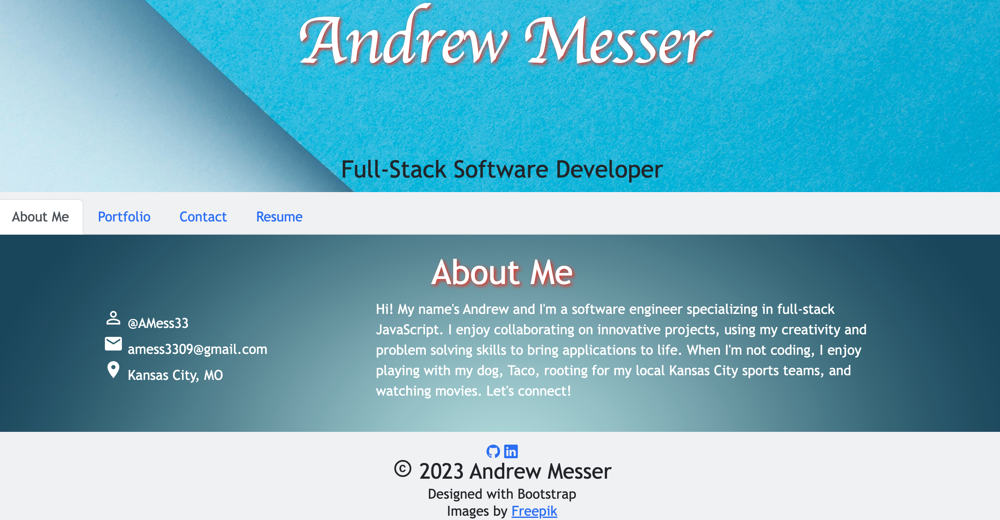

# Andrew Messer's Portfolio

## Andrew's professional portfolio created with React.js and styled with Bootstrap

This is my professional coding portfolio that I will use to track my career progression and show to potenial employers.

- I needed a portfolio to show potential employers what I can do.
- This will allow me to update my resume and portfolio projects as I advance in my software engineering career.
- I'm able to add this portfolio to my career search materials and allow me to prove to potential employers what I'm capable of.
- I learned how to implement a single page application by using the React.js library to build individual componenets to be displayed in the main content container.

## You can view my Portfolio from the link below, no installation required.

[Andrew Messer's Portfolio](https://amess33.github.io)

## Usage

When you open the webpage you will land on the homepage which displays the header, footer, and a content section. The default content is set to the About Me section. The Nav bar will allow you to browse my Portfolio of projects, my resume, or if you wish, send me an email from the Contact page.

## Credits

React.js and Bootstrap were used to create this page.
Images provided by [Freepik](https://www.freepik.com/)
